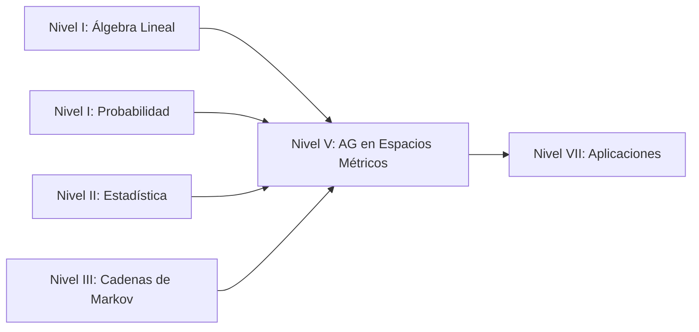

En este repositorio se encuentra trabajo realizado para la materia de Algoritmos Genéticos asi como parte de notas de clases complementadas con notas de procesos estocásticos.

[Puedes visitar también la página en la web](https://ag-notas.netlify.app/) 
 
## Contexto y Ubicación en la Ruta LLM

Este proyecto/documento presenta una exploración teórica de los **Algoritmos Genéticos (AG)** desde una perspectiva avanzada: su formulación y análisis en **espacios métricos generales**. Este enfoque permite extender los AG más allá del espacio euclidiano tradicional ($\mathbb{R}^n$), abriendo la puerta a la optimización en espacios de funciones, curvas, superficies y otras estructuras matemáticas más complejas.

Dentro de la **Ruta LLM** (definida en `Rutas_LLM.pdf`), este trabajo se ubica principalmente en el:

### **Nivel V: Machine Learning**

Específicamente, en la subcategoría de **Algoritmos Evolutivos**, que incluye:

- **Algoritmos Genéticos (GA)**
- **Estrategias Evolutivas (ES)**
- **Programación Evolutiva (EP)**

Este nivel se apoya directamente en los fundamentos desarrollados en los niveles previos de la Ruta:

| Nivel Ruta LLM | Conceptos Aplicados en este Trabajo |
|---|---|
| **Nivel I: Fundamentos Matemáticos** | Álgebra Lineal (espacios vectoriales, normas), Teoría de la Probabilidad (espacios de probabilidad, convergencia), Análisis Funcional (espacios métricos, de Banach, de Hilbert) |
| **Nivel II: Estadística e Inferencia** | Promedios empíricos, Ley de Grandes Números (base del límite de campo medio), distribuciones de probabilidad |
| **Nivel III: Procesos Estocásticos** | Cadenas de Markov (modelado de la evolución de la población), convergencia débil, propiedades de los kernels de transición |
| **Nivel IV: Infraestructura de Datos** | (No aplica directamente, pero los AG se implementan computacionalmente) |
| **Nivel V: Machine Learning** | **Algoritmos Genéticos** (núcleo del trabajo) |
| **Nivel VI: NLP** | (No aplica directamente) |
| **Nivel VII: Aplicaciones** | Optimización en espacios no convencionales (curvas, superficies, etc.) |


## Contenido del Trabajo

Este trabajo se compone de los siguientes elementos:

### 1. Exposición: "AG en Espacios Métricos Generales"

La exposición cubre los siguientes temas fundamentales:

#### a) Motivación y Contexto

- **Limitaciones de los AG en $\mathbb{R}^n$:** Los AG tradicionales operan en espacios vectoriales de dimensión finita, lo que no es adecuado para problemas donde las soluciones son objetos matemáticos más complejos.
- **Generalización a Espacios Métricos:** Se propone un marco donde el espacio de genotipos $(X, d)$ es un espacio métrico arbitrario. Esto permite definir:
    - **Vecindades:** A través de bolas abiertas $B(x, r) = \{y \in X : d(x, y) < r\}$.
    - **Convergencia:** Una sucesión $x_n \to x$ si $d(x_n, x) \to 0$.
    - **Continuidad de la función fitness:** $f: X \to \mathbb{R}$ es continua si $x_n \to x \implies f(x_n) \to f(x)$
#### b) Marco Teórico

- **Espacios de Genotipos:** Se discuten ejemplos como:
    - Espacios de Hilbert y de Banach.
    - Espacios de funciones (ej: $L^2[0,1]$).
    - Espacios de curvas y superficies.
- **Operadores Genéticos Generalizados:**
    - **Mutación:** Definida a través de kernels de probabilidad $K(x, \cdot)$ que representan la distribución de los descendientes de un individuo $x$.
    - **Cruce (Crossover):** Generalizado mediante kernels de cruce que toman dos padres y producen descendencia.
- **Selección:** Se mantiene como un operador que favorece a los individuos con mayor fitness, pero ahora debe ser definido en el espacio métrico.

#### c) Análisis de Convergencia

- **Modelo como Cadena de Markov:** La población de AG se modela como una Cadena de Markov en el espacio de poblaciones (subconjuntos finitos de $X$).
- **Límite de Campo Medio:** Se introduce el concepto de **media empírica**:
    $$
    \mu_t^N(A) = \frac{1}{N} \sum_{i=1}^{N} \mathbf{1}_{\{X_i^{(t)} \in A\}}
    $$
    que representa la proporción de individuos en el conjunto $A$. En el límite $N \to \infty$, $\mu_t^N$ converge a una medida de probabilidad determinista $\mu_t$.
- **Ecuación de Campo Medio:** La evolución de $\mu_t$ se describe mediante una ecuación determinista (no lineal) que captura el comportamiento "promedio" del AG.

#### d) Resultados y Teoremas Clave

- **Teorema de Rudolph (1997):** Un AG canónico con selección por ruleta, $0 \le P_c \le 1$ y $0 < P_m < 1$ **no converge** al óptimo global en el sentido de:
    $$
    \lim_{k \to \infty} \mathbb{P}(\hat{L}_{\min,k} = L(\theta^*)) \neq 1
    $$
- **Condiciones para la Convergencia:** Se discuten condiciones necesarias y suficientes para garantizar la convergencia, como la presencia de mutación con probabilidad positiva en todo el espacio y la ergodicidad de la cadena.

### 2. Notas de Clase: "AG en Espacios Métricos Generales (codificación real)"

Las notas complementan la exposición con:

- **Detalles Matemáticos:** Profundizan en la definición formal de espacios métricos, normas, y la relación entre ambos.
- **Implementación Práctica:** Se discuten aspectos de codificación real (frente a la codificación binaria estándar) y cómo se adaptan los operadores genéticos.
- **Conceptos Avanzados:**
    - **Kernels de Transición:** Formalización de los operadores de variación como kernels de probabilidad.
    - **Relación con Juegos Evolutivos:** Se menciona la conexión con la teoría de juegos y la dinámica de poblaciones.
    - **Principio de Máxima Entropía:** Se discute cómo la mutación puede interpretarse como la distribución de máxima entropía dados ciertos momentos (ej: varianza fija).


## Relación con la Ruta LLM: Mapeo Conceptual

El siguiente diagrama muestra cómo los conceptos de este trabajo se conectan con los niveles de la Ruta LLM:



## Evidencias incluidas

```
.
├── index.html                          # Portal
├── README.md
├── notas/
│   └── algoritmos_geneticos.html      #  notas de la materia
├── Exposición/
│   ├── AG-espacios-metricos.pdf    
│   └── AG-espacios-metricos.tex       #  archivo .tex para el beamer (pdf)
│   └── AG en espacios métricos generales (codificación real).md        # notas de lectura para la exposición homónima
```
